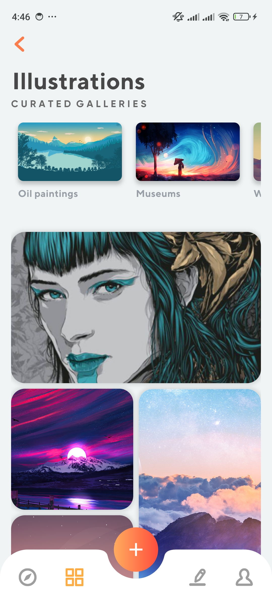
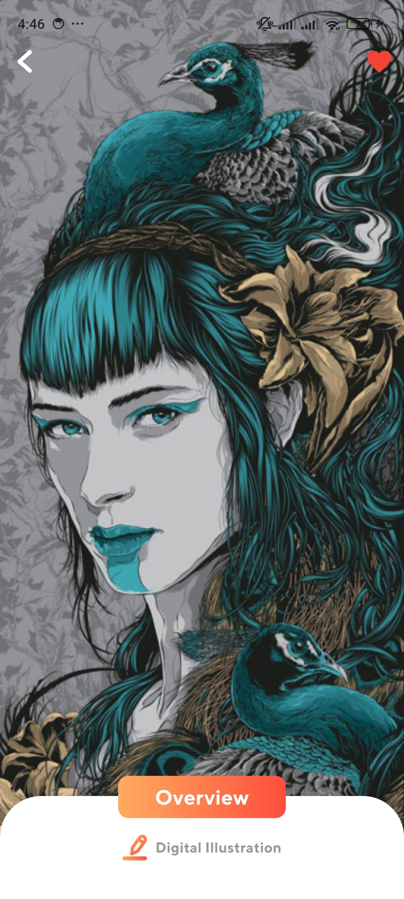
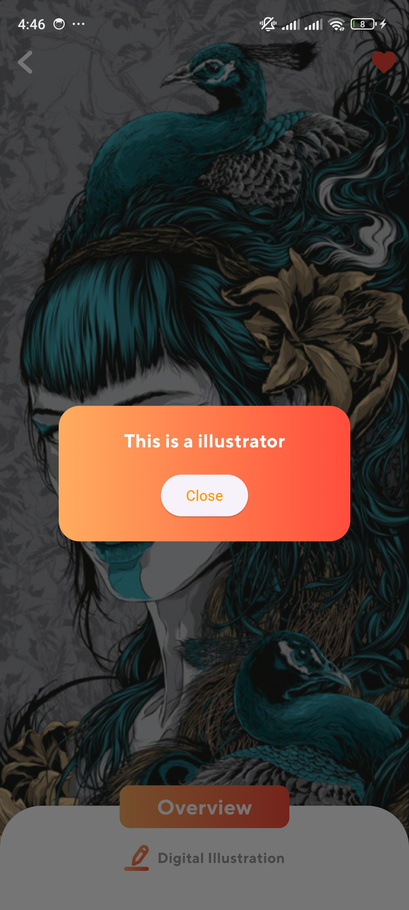

# Illustration App

Welcome to the Illustration App! This Flutter project showcases a dynamic interface for displaying illustrations, featuring an app bar with an SVG icon, a category row, and a grid view of images. The app is designed to provide an engaging and visually appealing experience for browsing and interacting with illustrations.

## Features

- **App Bar**: Contains an SVG icon for branding and navigation.
- **Category Row**: Allows users to filter illustrations by categories.
- **Grid View**: Displays a grid of illustrations with dynamic content.

## ScreenShoots






1. **Clone the Repository**

   ```bash
   git clone https://github.com/developedbyamin/illustration-app.git
    ```
   
2. **Navigate to the repository**

    ```bash
   cd illustration-app
   ```
   
3. **Install Dependencies**

    ```bash
   flutter pub get
   ```
   
4. **Run the App**

    ```bash
   flutter run
   ```

  